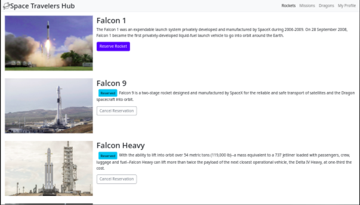
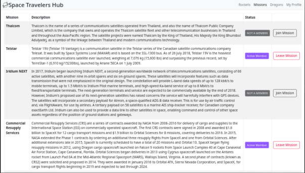
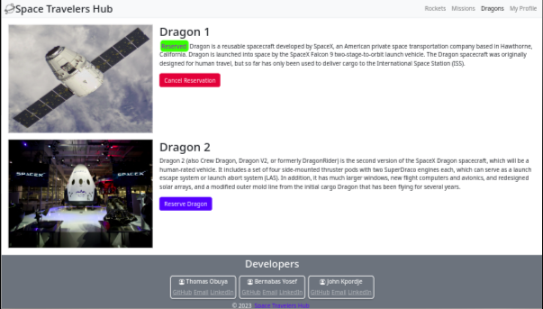
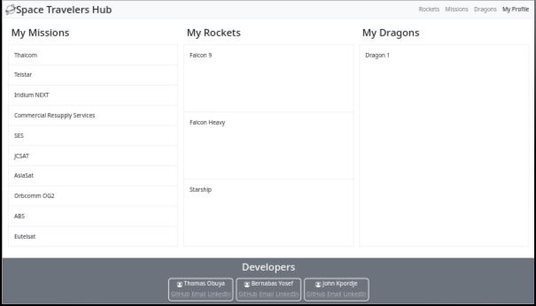

<a name="readme-top"></a>
[](https://github.com/tobuya/space_travelers_hubgraphs/contributors)
[](https://github.com/tobuya/space_travelers_hubcommits/dev)
[](https://github.com/tobuya/space_travelers_hub/stargazers)
[](https://github.com/tobuya/space_travelers_hub/issues)
[](https://github.com/tobuya/space_travelers_hub/blob/main/LICENSE)

<!-- TABLE OF CONTENTS -->

# 📗 Table of Contents

- [📗 Table of Contents](#-table-of-contents)
- [📖 Space Travelers Hub ](#-space-travelers-hub-)
  - [📸 Screenshots ](#-screenshots-)
  - [🛠 Built With ](#-built-with-)
    - [Tech Stack ](#tech-stack-)
    - [Key Features ](#key-features-)
      - [🔭 Future Features ](#-future-features-)
  - [🚀 Live Demo ](#-live-demo-)
  - [💻 Getting Started ](#-getting-started-)
    - [Setup](#setup)
    - [Install](#install)
    - [Usage](#usage)
    - [Testing](#testing)
    - [Deployment](#deployment)
  - [👥 Authors](#-authors)
  - [🤝 Contributing ](#-contributing-)
  - [⭐️ Show your support ](#️-show-your-support-)
  - [🙏 Acknowledgments ](#-acknowledgments-)
  - [📝 License ](#-license-)

<!-- PROJECT DESCRIPTION -->

# 📖 Space Travelers Hub <a name="about-project"></a>

>  Space Travelers Hub is a web application based on the real live data from the SpaceX API. This application will allow users to book rockets and join selected space missions.

## 📸 Screenshots <a name="screenshot"></a>

<p style="display: flex; flex-wrap: wrap; gap: 3px;">
  
  
  
  
</p>


## 🛠 Built With <a name="built-with"></a>

### Tech Stack <a name="tech-stack"></a>

<details>
  <summary>Languages</summary>
  <ul>
    <li>React</li>
    <li>Redux</li>
    <li>React Bootstrap</li>
  </ul>
</details>
<details>
  <summary>Bundler</summary>
  <ul>
    <li>Webpack</li>
  </ul>
</details>
<details>
  <summary>Server</summary>
  <ul>
    <li>Github</li>
  </ul>
</details>

<!-- Features -->

### Key Features <a name="key-features"></a>

- **Book rockets**
- **Join selected space missions**
- **Join selected space dragons**
- **Interactive and Responsive**

<p align="right">(<a href="#readme-top">back to top</a>)</p>

#### 🔭 Future Features <a name="future-features"></a>

- **Toggle modes according to times of the day**

<!-- LIVE DEMO -->

## 🚀 Live Demo <a name="live-demo"></a>

- <a href="https://space-travelers-hub-ihk3.onrender.com" target="_blank">Live Demo Link</a>

<p align="right">(<a href="#readme-top">back to top</a>)</p>

<!-- GETTING STARTED -->

## 💻 Getting Started <a name="getting-started"></a>

To get a local copy up and running, follow these steps.

### Setup

Clone this repository to your desired folder:

```sh
  git clone https://github.com/tobuya/space_travelers_hub
  cd space_travelers_hub
```

### Install

Install this project with:

```sh
  npm install
```

### Usage

To run the project in a development server, execute the following command:

```sh
  npm start
```

### Testing

To run the tests in a development server, execute the following command:

```sh
  npm test
```

To to build for the production, execute the following command:

```sh
  npm run build
```

### Deployment

You can deploy this project using [Github Pages](https://docs.github.com/en/pages/getting-started-with-github-pages/creating-a-github-pages-site)

<p align="right">(<a href="#readme-top">back to top</a>)</p>

<!-- AUTHORS -->

## 👥 Authors

<a name="authors"></a>

👤 **Thomas Obuya**

- GitHub: [Tobuya](https://github.com/tobuya)
- Twitter: [Tobuya](https://twitter.com/@MullerTheGreat1)
- LinkedIn: [LinkedIn](https://linkedin.com/in/tobuya/)

👤 **Bernabas Yosef**

- GitHub: [Bernabasy](https://github.com/bernabasy)
- Twitter: [Bernabasy](https://twitter.com/@bernabasjosef)
- LinkedIn: [LinkedIn](https://www.linkedin.com/in/bernabas-yosef-74b571186)

👤 **Outkarm Johnson**

- GitHub: [Outkarm](https://github.com/Outkarm)
- GitHub: [Outkarm](https://github.com/Outkarm)
- LinkedIn: [LinkedIn](https://www.linkedin.com/in/john-kpordje-866749241/)

<p align="right">(<a href="#readme-top">back to top</a>)</p>


<!-- CONTRIBUTING -->

## 🤝 Contributing <a name="contributing"></a>

Contributions, issues, and feature requests are welcome!

Feel free to check the [issues page](https://github.com/tobuya/space_travelers_app).

<p align="right">(<a href="#readme-top">back to top</a>)</p>

<!-- SUPPORT -->

## ⭐️ Show your support <a name="support"></a>

If you like this project give me a star.

<p align="right">(<a href="#readme-top">back to top</a>)</p>

<!-- ACKNOWLEDGEMENTS -->

## 🙏 Acknowledgments <a name="acknowledgements"></a>

We would like to thank Microverse and our fellow micronauts.

<p align="right">(<a href="#readme-top">back to top</a>)</p>

<!-- LICENSE -->

## 📝 License <a name="license"></a>

This project is [MIT](https://github.com/Lucash2022/tv-hub-app/blob/develop/MIT.md) licensed.

<p align="right">(<a href="#readme-top">back to top</a>)</p>
